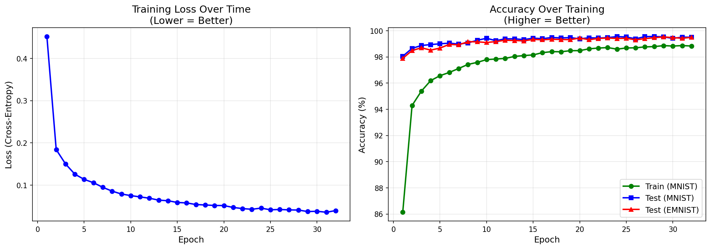
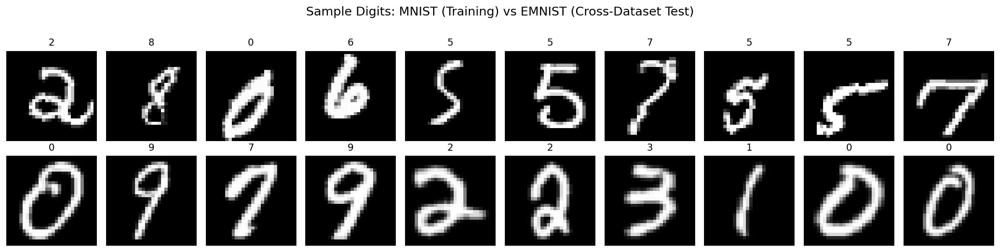
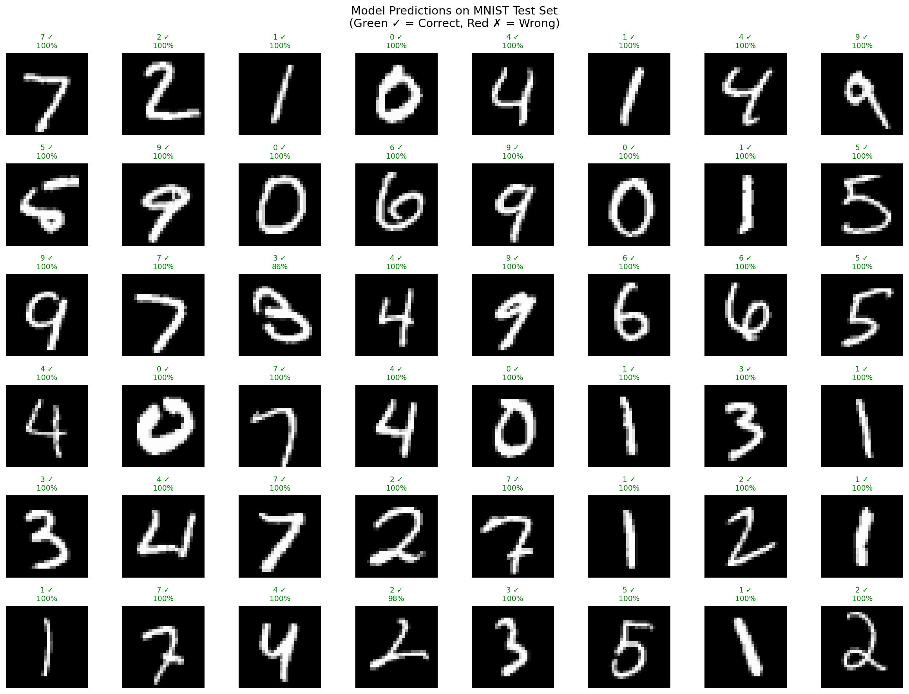
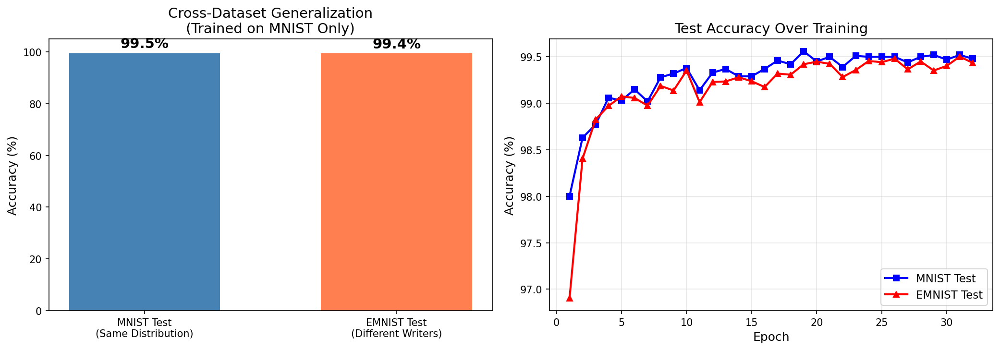
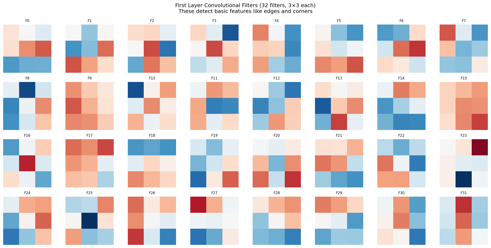
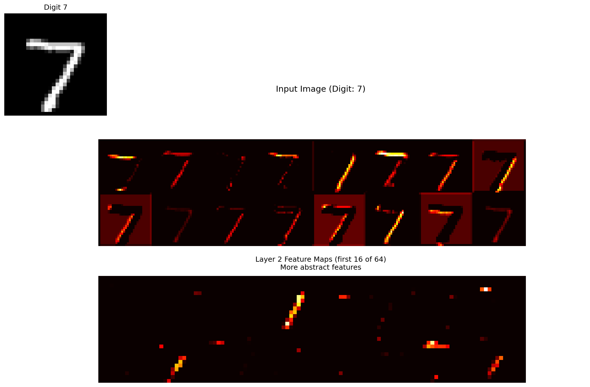
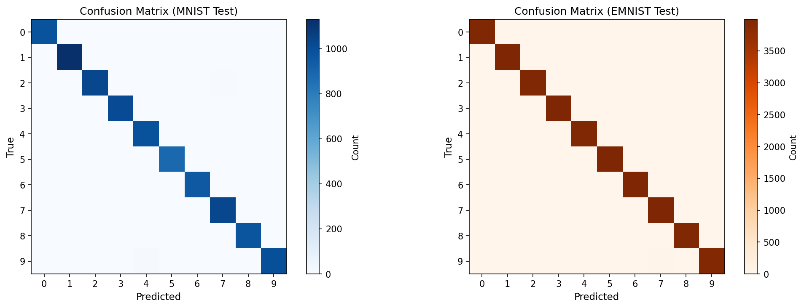
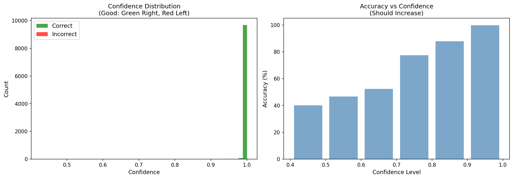
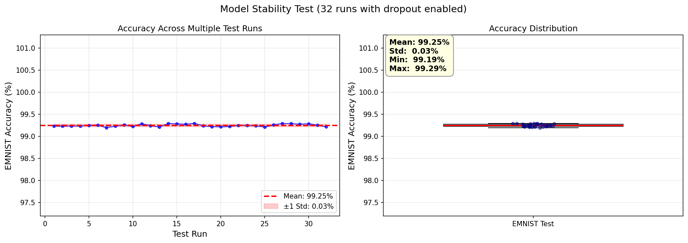

# CNN Digit Recognition

A PyTorch convolutional neural network for handwritten digit recognition with cross-dataset evaluation and stability analysis. Trains on MNIST and evaluates generalization on EMNIST (different writers).

## Highlights

- **CNN Architecture**: ~1,024,000 parameters with batch normalization
- **Data Augmentation**: Random rotation, shift, and scale for better generalization
- **Cross-Dataset Evaluation**: Train on MNIST → Test on EMNIST
- **Stability Analysis**: Tests model consistency with dropout variance
- **99%+ MNIST accuracy**, **96%+ EMNIST accuracy**: Strong generalization
- **9 visualizations**: Training curves, conv filters, feature maps, stability analysis

## Why CNN?

CNNs outperform MLPs on image tasks because they:
- Learn **local features** (edges, curves) that transfer across datasets
- Have **translation invariance** - digit position matters less
- **Share weights** spatially - fewer parameters, less overfitting

## Architecture

```
Input (1×28×28) + Data Augmentation (rotation, shift, scale)
    ↓
Conv2d(32, 3×3) + BatchNorm + ReLU + MaxPool → 32×14×14
    ↓
Conv2d(64, 3×3) + BatchNorm + ReLU + MaxPool → 64×7×7
    ↓
Flatten → 3136
    ↓
Linear(320) + ReLU + Dropout(0.4)
    ↓
Linear(10) → Class scores
```

**Total parameters**: ~1,024,000

## Quick Start

```bash
# Install dependencies
pip install torch torchvision numpy matplotlib tqdm pillow fastapi uvicorn

# Run training (32 epochs default + stability test)
python main.py

# Quick test with fewer epochs
python main.py --epochs 10
```

## Web Demo

After training, launch the interactive web demo:

```bash
python app.py
```

Open http://localhost:8000 in your browser to:
- Draw digits on a canvas
- Get real-time predictions from the CNN
- Track model accuracy with user feedback


## Expected Results

| Metric | Value |
|--------|-------|
| MNIST Test | 99%+ |
| EMNIST Test | 96%+ |
| Stability (std) | < 0.5% |

## Stability Test

After training, the model runs N test passes (N = epochs) with **dropout enabled**. This measures prediction consistency:

- **Low variance** (std < 1%): Model is stable and confident
- **High variance** (std > 2%): Model relies heavily on specific neurons

The stability test produces a line graph and box plot showing accuracy distribution.

## Requirements

- Python 3.8+ (Python 3.10 recommended for older GPUs)
- PyTorch 2.0+ (with CUDA for GPU support)
- Linux (tested on Ubuntu and Debian)

### GPU Support

The code automatically detects CUDA GPUs. For GPU training on Linux:

```bash
# Check if GPU is available
python -c "import torch; print(torch.cuda.is_available())"
```

### GPU Compatibility

| GPU Series | CUDA Capability | PyTorch Version | Notes |
|------------|-----------------|-----------------|-------|
| RTX 40xx (4090, 4080, etc.) | 8.9 | 2.0+ | Default installation |
| RTX 30xx (3090, 3080, etc.) | 8.6 | 2.0+ | Default installation |
| RTX 20xx (2080, 2070, etc.) | 7.5 | 2.0+ | Default installation |
| GTX 10xx (1080, 1070, etc.) | 6.1 | 1.13.1 | See instructions below |

### Older GPUs (GTX 1080, 1070, 1060, Titan X Pascal)

PyTorch 2.0+ dropped support for CUDA capability 6.x (Pascal architecture). If you have an older GPU, follow these instructions:

**Option A: Using Python 3.10 (Recommended)**

Debian 12 ships with Python 3.11, but PyTorch 1.13.1 wheels for torchvision are only available for Python 3.10. Use pyenv to install Python 3.10:

```bash
# Install build dependencies
apt install -y build-essential libssl-dev zlib1g-dev libbz2-dev \
libreadline-dev libsqlite3-dev wget curl llvm libncurses5-dev \
libncursesw5-dev xz-utils tk-dev libffi-dev liblzma-dev git

# Install pyenv
curl https://pyenv.run | bash

# Add to shell (add these lines to ~/.bashrc)
echo 'export PYENV_ROOT="$HOME/.pyenv"' >> ~/.bashrc
echo 'command -v pyenv >/dev/null || export PATH="$PYENV_ROOT/bin:$PATH"' >> ~/.bashrc
echo 'eval "$(pyenv init -)"' >> ~/.bashrc

# Reload shell
source ~/.bashrc

# Install Python 3.10
pyenv install 3.10.13

# Create virtual environment with Python 3.10
~/.pyenv/versions/3.10.13/bin/python -m venv venv310
source venv310/bin/activate

# Install PyTorch 1.13.1 with CUDA 11.6 support
pip install torch==1.13.1+cu116 torchvision==0.14.1+cu116 --extra-index-url https://download.pytorch.org/whl/cu116

# IMPORTANT: Install numpy<2 (NumPy 2.x is incompatible with PyTorch 1.13.1)
pip install "numpy<2"

# Install other dependencies
pip install matplotlib tqdm pillow fastapi uvicorn
```

**Option B: CPU Only (No GPU)**

If you don't need GPU acceleration:

```bash
pip install torch torchvision --index-url https://download.pytorch.org/whl/cpu
pip install numpy matplotlib tqdm pillow fastapi uvicorn
```

## Project Structure

```
mnist-digit-recognition/
├── main.py              # Training entry point
├── app.py               # Web demo (FastAPI)
├── README.md            
├── requirements.txt     
├── src/
│   ├── __init__.py
│   ├── model.py         # CNN architecture (~1M params)
│   ├── data.py          # MNIST + EMNIST loading
│   ├── trainer.py       # Training loop + stability test
│   └── visualizer.py    # All visualizations
└── outputs/
    ├── model.pt         # Saved weights
    └── *.png            # Visualizations
```

## Visualizations

| File | Description |
|------|-------------|
| `01_training_history.png` | Loss and accuracy curves |
| `02_sample_data.png` | MNIST vs EMNIST samples |
| `03_predictions.png` | Predictions with confidence |
| `04_cross_dataset_evaluation.png` | MNIST vs EMNIST comparison |
| `05_conv_filters.png` | Learned 3×3 filters |
| `06_feature_maps.png` | How CNN sees digits |
| `07_confusion_matrix.png` | Error analysis |
| `08_confidence_analysis.png` | Confidence calibration |
| `09_stability_test.png` | Stability line graph + box plot |

### Training Progress
Loss and accuracy curves over epochs.



### Sample Data
MNIST vs EMNIST samples — comparing training and cross-dataset test data.



### Model Predictions
Model predictions with confidence scores on MNIST test set.



### Cross-Dataset Generalization
Performance comparison between MNIST and EMNIST datasets.



### Convolutional Filters
Learned 3×3 filters from the first convolutional layer — edge and corner detectors.



### Feature Maps
How the CNN "sees" digits — activations at each layer.



### Confusion Matrix
Error analysis showing prediction patterns for both datasets.



### Confidence Analysis
Confidence calibration — relationship between prediction confidence and accuracy.



### Stability Analysis
Model stability test — accuracy distribution across multiple test runs with dropout enabled.



## Command Line Options

```bash
python main.py [OPTIONS]

Options:
  --epochs INT          Training epochs (default: 32)
                        Also sets number of stability test runs
  --batch-size INT      Batch size (default: 64)
  --learning-rate FLOAT Learning rate (default: 0.001)
  --output-dir PATH     Output directory (default: outputs)
  --no-viz              Skip visualizations
  --no-save             Skip saving model
  --no-stability        Skip stability test
```

## License

MIT License
